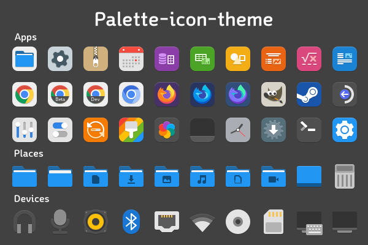
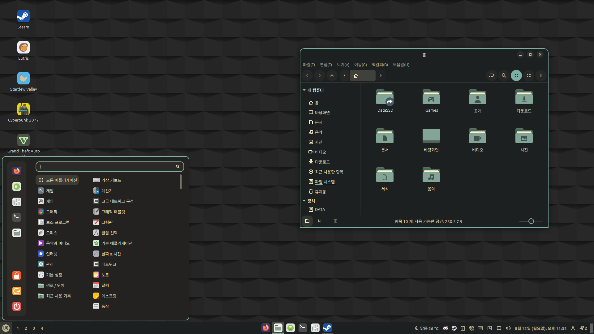
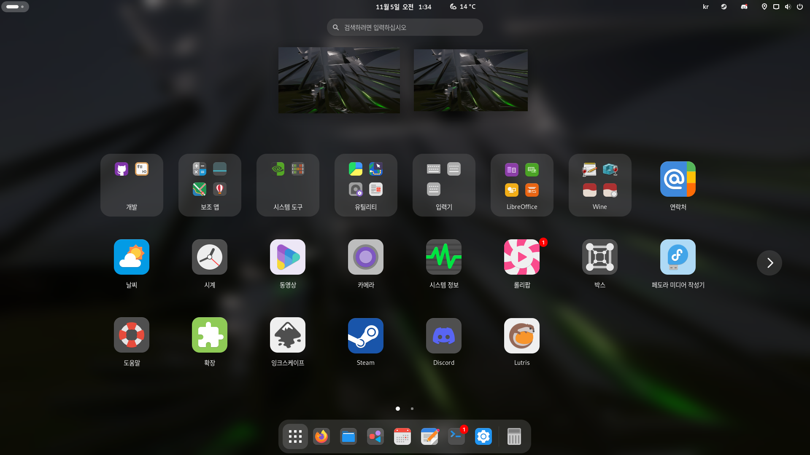
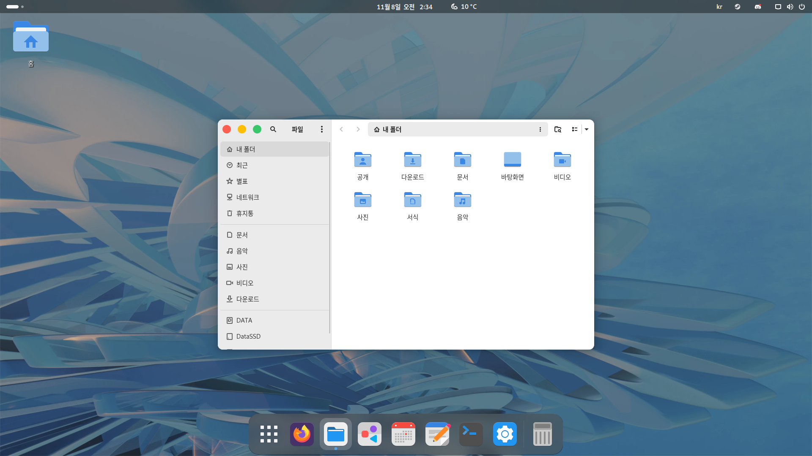

# Palette-icon-theme
Material Design icon theme

## Based on

* papirus-icon-theme(designs) : Inherits with Papirus-icon-theme for some missing icons.
* Tela-icon-theme(symbolic icons) : 

## Preview

* Gruvbox Color

* Dark Mode App icon

* Adwaita (for GNOME)

## Color Variant

* Adwaita
* Gruvbox
* Nord (WIP)

## To-Dos

- [x] Experimental Dark Mode icon Support

- [x] Adwaita Color Support
